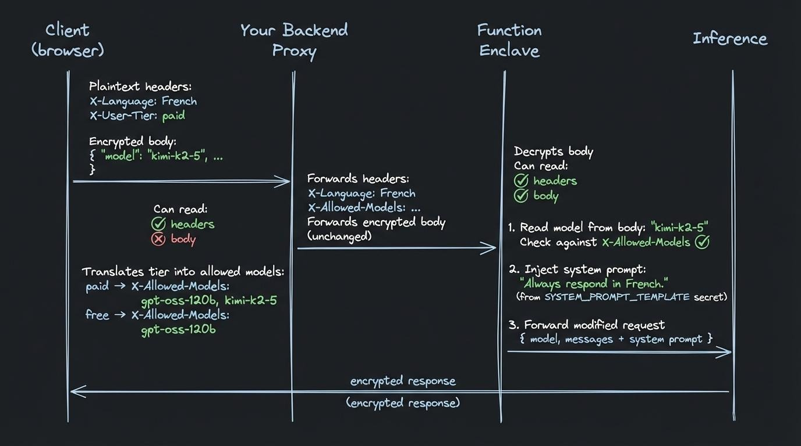

# System Prompt Injector

With the [basic encrypted proxy](https://github.com/tinfoilsh/encrypted-request-proxy-example), your backend forwards encrypted inference requests without being able to read or modify the request body. But sometimes you need to operate on the request body, such as, inject a system prompt, enforce which models a user can access, or transform the request before it reaches inference.

## The solution: Preprocessing via Tinfoil Functions

A Tinfoil Function is your code running inside an attested enclave. It receives the decrypted request body, processes it, and forwards the result to inference. Because this pre-processing hook is running in a secure enclave, the same security guarantees of inference are maintained.

This example demonstrates two use cases:

1. **System prompt injection**: The function injects a server-side system prompt (stored as an enclave secret) into every request. The client influences it via a language preference header, but never sees or controls the prompt itself.

2. **Model access control**: The proxy determines which models a user can access (based on their tier) and communicates this to the function via a header. The function reads the model from the decrypted body and rejects unauthorized requests. The proxy sets the policy and the function enforces it.


## Request flow



**What each party can see:**

| | Headers | Request body | System prompt |
|---|---|---|---|
| **Client** | all | own message | no |
| **Your proxy** | all | no (encrypted) | yes (you configure it) |
| **Function enclave** | all | yes (decrypted) | yes (enclave secret) |

**Headers added by this example (not in the base encrypted proxy):**

| Header | Direction | Purpose |
|---|---|---|
| `X-Language` | Client → Proxy → Function | Controls the `{{LANGUAGE}}` placeholder in the system prompt |
| `X-User-Tier` | Client → Proxy | The proxy reads this to determine which models the user can access |
| `X-Allowed-Models` | Proxy → Function | The function checks the model in the encrypted body against this list |

## Quick start

### 1. Run the proxy

```bash
cd proxy
go run .
```

Listens on `:8080`. Forwards encrypted requests and headers to the function enclave.

### 2. Run the browser client

```bash
cd client
npm install
npx vite
```

Opens at `http://localhost:5173`. Pick a language and model from the dropdowns and send a message. The client attests the function enclave, encrypts the request body end-to-end, and streams the response.

Update `enclaveURL` and `configRepo` in `client/main.ts` to point to your deployed function.

## Deploying the function

The root `Dockerfile` builds only the function server. The proxy and client run outside the enclave.

1. Configure Tinfoil secrets:
   - `SYSTEM_PROMPT_TEMPLATE` — e.g. `You are a helpful assistant. Always respond in {{LANGUAGE}}.`
2. Push a version tag to trigger `.github/workflows/build.yml`, which builds and pushes the Docker image to GHCR, then creates a Sigstore attestation via `tinfoilsh/pri-build-action`

## Structure

| Path | Runs in | Description |
|------|---------|-------------|
| `function/` | Enclave | Go server — injects system prompt, enforces model access, forwards to inference |
| `proxy/` | Your backend | Forwards encrypted requests, sets `X-Allowed-Models` based on user tier |
| `client/` | Browser | Chat UI with language, model, and tier selectors |
| `Dockerfile` | CI | Builds the function server only |
| `tinfoil-config.yml` | CI | Enclave config (secrets + shim) |
